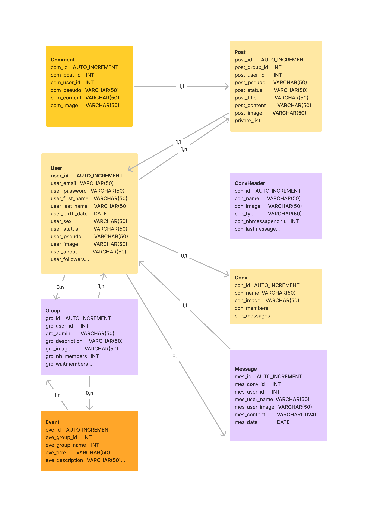
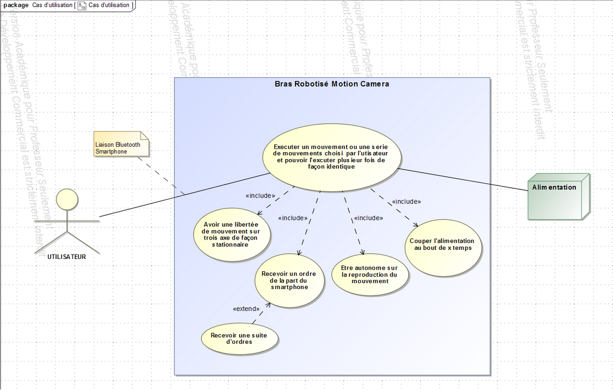
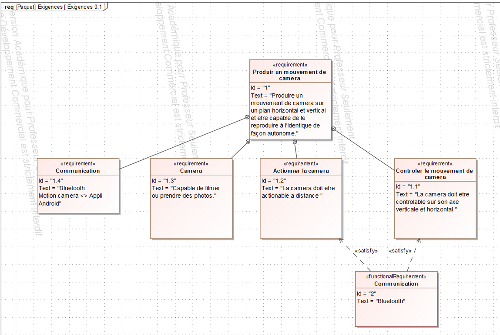

### Création d’une maquette (MCD, MLD, MPD)

J'ai réalisé plusieurs projets où j'ai mis en pratique la création de maquettes en suivant les spécificités fonctionnelles décrites dans les cas d'utilisation et les User Stories. Voici comment j'ai abordé cette tâche :

##### Modèle Conceptuel des Données (MCD)
_Social Network_

##### Projet delivrone
* Diagram de cas d'utilisation
* Modele conceptuel de données

#### Extras
##### Diagram de cas d'utilisation
_Projet de bac_

##### Diagram d'exigence
_Projet de bac_

